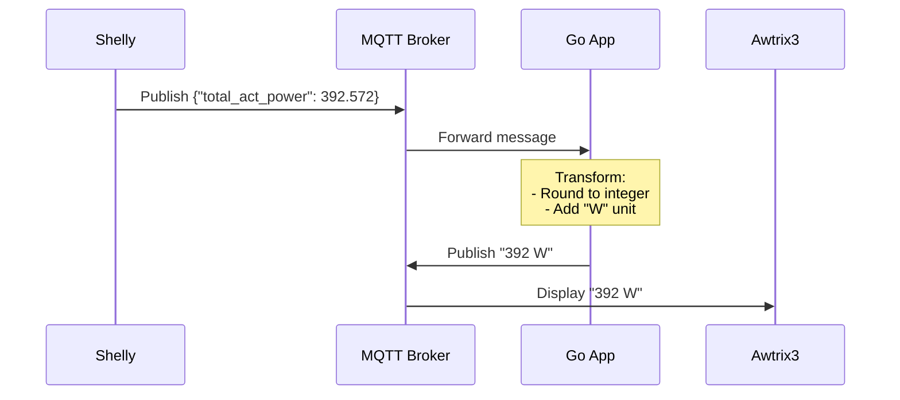
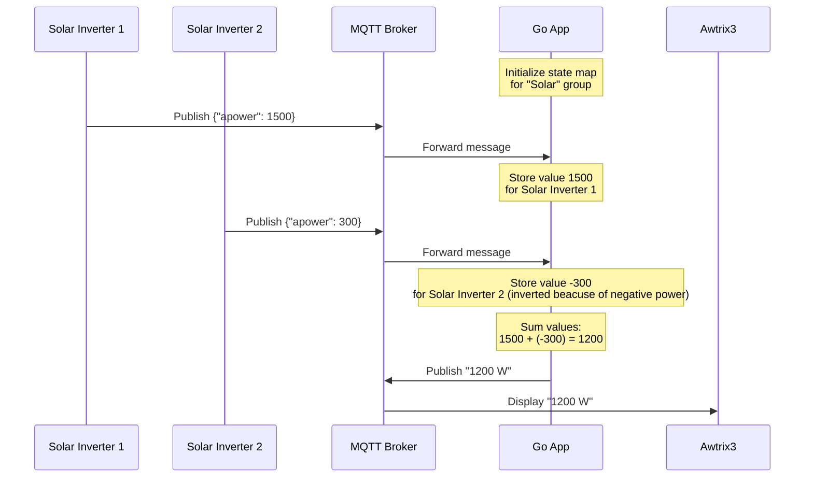

[](https://github.com/dhcgn/go-mqtt-dispatcher/actions/workflows/go.yml)
[](https://codecov.io/github/dhcgn/go-mqtt-dispatcher)
[](https://hub.docker.com/r/dhcgn/go-mqtt-dispatcher)

# go-mqtt-dispatcher

A lightweight Go application that transforms MQTT messages between devices. It subscribes to source topics, processes numeric data using JSONPath extraction and formatting, and republishes the transformed messages to target topics compatible to **Awtrix 3**.

Key features:

- Transforms numeric MQTT payloads using JSONPath
- Supports message accumulation from multiple sources
- Formats output with customizable templates
- Designed for IoT dashboard displays like Awtrix 3
- Works with any MQTT-capable device as data source

Ideal for:

- Converting raw sensor data to human-readable formats
- Aggregating values from multiple IoT devices
- Creating formatted displays from MQTT data streams
- Real-time data transformation pipelines

```yaml
# Example: Transform temperature reading
Input:  {"sensor": {"temp": 23.456}}
Output: {"text": "23°C"} # Format of Awtrix 3
```

Docker image available for easy deployment.

## Stats


## Use case:

Send data to the [awtrix 3 mqtt api](https://blueforcer.github.io/awtrix3/#/api?id=example-1), the current feature [mqtt-placeholder](https://blueforcer.github.io/awtrix3/#/api?id=mqtt-placeholder) is not sufficient for all use cases.

Shelly publishes on mqtt `{"total_act_power": 392.572}` and this app transforms it to `392 W` and sends it to the awtrix 3 device trough mqtt.

## Current limitations

- Only works with numeric values
- No authentication to mqtt
- Only protocol `mqtt://` is supported
- No TLS support

## Sequence Diagram



### Accumulation Sequence Diagram



## Example

### Source

> From a Shelly Pro 3EM shellypro3em-00000000000 the value of the json property `"total_act_power"` from the topic `.../status/em:0`.

Topic: `shellies/shellypro3em-00000000000/status/em:0`

Payload:

```json
{
    "id": 0,
    "a_current": 0.595,
    "a_voltage": 225.3,
    "a_act_power": -60.2,
    "a_aprt_power": 134.0,
    "a_pf": 0.45,
    "a_freq": 50.0,
    "b_current": 1.041,
    "b_voltage": 223.9,
    "b_act_power": 72.8,
    "b_aprt_power": 233.1,
    "b_pf": 0.32,
    "b_freq": 50.0,
    "c_current": 2.057,
    "c_voltage": 224.3,
    "c_act_power": 379.9,
    "c_aprt_power": 461.5,
    "c_pf": 0.82,
    "c_freq": 50.0,
    "n_current": null,
    "total_current": 3.693,
    "total_act_power": 392.572,
    "total_aprt_power": 828.614,
    "user_calibrated_phase": []
}
```


### Target

> To a awtrix 3 device, a custom app `house power` with the text `392 W`.

Topic: `awtrix_b77810/custom/house power`

```json
{
  "text": "392 W",
  "icon": "redplug" // optional
}
```

`redplug` is the icon name for a red power plug, which must be uploaded to the awtrix 3 device. 

### Config

```yaml
mqtt:
  broker: mqtt://192.168.1.1:1883

topics:
  - subscribe: "shellies/shellypro3em-0000000000/status/em:0"
    transform:
      jsonPath: "$.total_act_power"
      outputFormat: "%.0f W"
    publish: "awtrix_0000000000/custom/house power"
    icon: "redplug"
topics_accumulated:
  - Gruop: "Solar"
    publish: "awtrix_000000000/custom/solar power"
    icon: "ani_sun"
    operation: sum
    outputFormat: "%.0f W"
    topics:
      - subscribe: "shellies/shellypro4pm-000000000000/status/switch:2"
        transform:
          jsonPath: "$.apower"
      - subscribe: "shellies/shellyplusplugs-000000000000/status/switch:0"
        transform:
          jsonPath: "$.apower"
          invert: true
      
```

# MQTT Dispatcher

## Running with Docker

Run the container by mounting your config file as a volume:

```
docker run -v /path/to/config.yaml:/app/config.yaml dhcgn/mqtt-dispatcher:latest
```

The config file must be an absolute path!